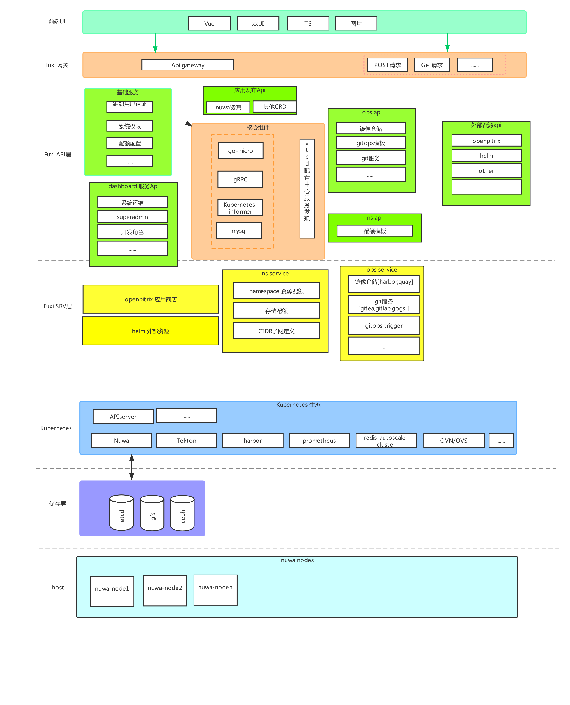

# Fuxi Cloud Alpha

[](https://github.com/yametech/fuxi/actions?workflow=fuxi)

* 背景：容器化背景下，基于kubernetes的管理开发，微服务盛行；为解决企业、用户等快速低成本上线使用容器化及享受容器化后带来的增值；

* 前提：为何要造轮子？因为测试多厂商OpenShift、Rancher、360Wayne等等开源PaaS平台，使用接入开发运维学习成本依然不会降低（就是懂的人不需要，需要的人不懂）；其次当前 PaaS平台裸金属（bare metal）机器上使用的各种网络限制及资源隔离问题；使用kubernetes变成的使用裸机器会变成二等公民化；

* 解决目标：用户发布部署通俗化+专业化两种模式、自动CICD devops+gitops、自动化集群部署、日志分析，应用画像等等；最为重要的一点实现命名空间之间的网络隔离(calico其实也能隔离，就是机器上很多iptables，大集群排查问题困难，集群节点多BGP问问题等等),首先我们在第一阶段实现也使用calico隔离,but 有一天我们发现在kube-ovn项目,经过测试kube-ovn可以在开发环境里使用,而且网络带宽损失率小于0.01%,经过研究kube-ovn实现,发现该项目维护性比较简单,拓展性也不错,故第二阶段实现基于OpenFlow协议开发虚拟交换机，虚拟路由器网关等,路由实现以OSPF协议，多集群使用时通过预先规划把多机房多集群间的网络；


## 开发
项目目录说明
```bash
├── CHANGELOG.md              --- 发布版本后,每次修改日志
├── CONTRIBUTORS.md           --- 提交者
├── Makefile                  --- 项目代码check,build; 开发者使用make check && make build 构建自己的服务输出到目录bin
├── README.MD
├── cmd                       --- 对外api,gin封装,gateway预装载插件
│   └── gateway
├── bin                       --- 二进制程序,api-程序名/srv-程序名
│   ├── api-gateway
│   └── srv-ops
├── build                     --- 构建程序服务
│   ├── build.sh
│   └── lint.sh
├── data                      --- 开发时临时数据装载
│   ├── consul
│   └── mysql
├── demand                    --- 需求文档
│   ├── giter.md
│   ├── log.md
│   ├── ops.md
│   ├── registry.md
│   ├── 设计.md
│   └── 需求.md
├── docker-compose.yaml       --- 开发环境docker-compose
├── docs                      --- 文档说明
│   ├── README_ER.md
│   ├── architectures.png
│   └── permission.jpg
├── go.mod
├── go.sum
├── pkg                       --- 公用库
│   ├── docker
│   ├── k8s
│   ├── kafka
│   └── mysql
│   └── ...
├── prometheus.yml
├── proto                     --- go-micro 基础base,对外部服务接口规范协议模板
│   └── base.proto
├── scripts                   --- 脚本
│   ├── CHANGELOG.md
│   ├── CONTRIBUTORS.md
│   ├── README.md
│   ├── host
│   └── sql-script
├── srv                       --- 服务程序包
│   ├── giter
│   ├── ops
│   └── registry
├── thirdparty                --- 引用第三方代码,发布时必须依照原作者授权与说明
│   └── lib
├── util                      --- 工具库
│   └── hack
└── vendor                    --- 依赖
    ├── github.com
    ├── go.uber.org
    ├── golang.org
    ├── google.golang.org
    ├── gopkg.in
    ├── gotest.tools
    ├── k8s.io
    ├── modules.txt
    └── sigs.k8s.io
```

使用go-micro创建一个服务

```bash
cd ${PROJECT}
创建服务
micro new --type=srv github.com/yametech/fuxi/srv/{server_name}
创建api
micro new --type=api github.com/yametech/fuxi/cmd/{api_name}
```

## 需求设计
http://github.com/yametech/fuxi/src/master/demand

## API接口设计文档

https://www.showdoc.cc/dworlds 访问密码: 123123


## 项目编写规范
1.每个目录需要有独立的README.md、CHANGELOG.md、CONTRIBUTORS.md 具体可以参考：http://github.com/yametech/fuxi/src/master/api/user

2.api初始化,创建方式参考 : http://github.com/yametech/fuxi/src/master/api/user/README.md, srv初始化参考 

3.每个服务公共部份的抽象代码请在pkg目录下生成，例如: 公用的 ${WORKSPACE}/pkg/k8s/client ${WORKSPACE}/pkg/docker/client 或者 相关业务的服务抽象、协议等

4.主机/docker操作的一些shell脚本目录在scripts, 例如：${WORKSPACE}/scripts/host/docker_ip.sh

5.docs目录主要存放一些实现设计文档，每个设计文档使用README_{APP}.md的方式编写,例如公用的ER设计,README_ER.md

### 开发配置
```
#数据库配置
etcdctl put /go/micro/database '{"db":{"host":"127.0.0.1","port":3306,"user":"root","password":"123","db":"skp"}}'
#jwt security key
etcdctl put /go/micro/jwt '{"key":"nishidabendan"}'
#白名单
etcdctl put /go/micro/urls '{"list":["/metrics","/base/v1/user/login"]}'
#k8s
etcdctl put /go/micro/kubernetes '{"k8s":{"name":"kubernetes","config":{
  "apiVersion": "v1",
  "clusters": [
    {
      "cluster": {
        "certificate-authority-data": "LS0tLS1CRUdJTiBDRVJUSUZJQ0FURS0tLS0tCk1JSUN5RENDQWJDZ0F3SUJBZ0lCQURBTkJna3Foa2lHOXcwQkFRc0ZBREFWTVJNd0VRWURWUVFERXdwcmRXSmwKY201bGRHVnpNQjRYRFRFNU1USXdNekE1TURFME1Gb1hEVEk1TVRFek1EQTVNREUwTUZvd0ZURVRNQkVHQTFVRQpBeE1LYTNWaVpYSnVaWFJsY3pDQ0FTSXdEUVlKS29aSWh2Y05BUUVCQlFBRGdnRVBBRENDQVFvQ2dnRUJBTU9XCk1ub3FNRzA3YWxxOUFEVXc3bkN6ZXJiUzRRdzhwWWlkVkZYZHRrQ3JKK0xJR21QcXJ1Y1VkL0o2aGpzREhrRVkKbGplT1M2cGxUWXNmSVlWL1JRQmQ2WGZQcVc5OTgrSXdhYmFoTzdlQmx0MVgyanJiWlBUVm4yeXZwcGRCTUp0dgp5OHo3MkYrK1RES0V5VnJoVXF6UUJCTC95bEJDeWFPNnpYbHovYlhXWm1IWXRBTjVNQ3R4ekRGQWhycWl5WGY4Cjk0MkxhbWZmQ1N0VFN2SXo2OE81dVpZSS82RzFOaW9jaTZvMDVibHIzWmY1Q2xnTERkcUV1ckw2a3hTOHY4a3kKMTdIWndSS2NqcDZoMzZ2cUdURlQ2Zm9IdjFzNjd4c3g0U3FacEpEbmVOVDVDZWJRMWdLTytXUVl5dmVoNkpnSgp4My9QRkthR0RKMlRCd3lBNWNzQ0F3RUFBYU1qTUNFd0RnWURWUjBQQVFIL0JBUURBZ0trTUE4R0ExVWRFd0VCCi93UUZNQU1CQWY4d0RRWUpLb1pJaHZjTkFRRUxCUUFEZ2dFQkFFTlFTQWxtekVac1g4RU82aFFZRmpDTjdLNGwKSDZvd3l2aisvdDBlelkzS0NjUEJMaTJlbFMyeklBVjNic2pDUndSc1h1ekMrTnhmcXhvVkRyekdmOE5pVWFZMgorZFZ5UlNLbXdCYzFmRjdoNTQrT0hmaS9DZVE4RlR3OE9aWkdPaDBBdXYyM1M4THh6SGEwMEZ1YWpLTDFpWTUwCllTVllZU1MrblBBMlM0TTFkTTNXSGdTMmZPdWV2b0djTm14MXdVRENMdnV2NkN0YjhVU0xFbDJCOWpPb1RFVFgKZUZtaEFGNXVmMjJuRWlubHdKeUVzTjY2OXBPaGdiQXZXbDFxdkxhbDlHTjBWR3NYNFhaTVpHSkt4YkVTUmhLNwpxekE5cFlZbnlwRngxd3phN1g2aUdCeWVGeTZDS1FGS3J4dTV0VUhHZGQ5cmhUcU9Td0JoWVVXeEFoMD0KLS0tLS1FTkQgQ0VSVElGSUNBVEUtLS0tLQo=",
        "server": "https://apiserver.node1:6443"
      },
      "name": "kubernetes-m"
    },
    {
      "cluster": {
        "certificate-authority-data": "LS0tLS1CRUdJTiBDRVJUSUZJQ0FURS0tLS0tCk1JSUN5RENDQWJDZ0F3SUJBZ0lCQURBTkJna3Foa2lHOXcwQkFRc0ZBREFWTVJNd0VRWURWUVFERXdwcmRXSmwKY201bGRHVnpNQjRYRFRFNU1USXdOREF6TlRBd09Gb1hEVEk1TVRJd01UQXpOVEF3T0Zvd0ZURVRNQkVHQTFVRQpBeE1LYTNWaVpYSnVaWFJsY3pDQ0FTSXdEUVlKS29aSWh2Y05BUUVCQlFBRGdnRVBBRENDQVFvQ2dnRUJBTFlzCkxBbFZnZE9qWlY4cmIwS1Ewd1ZPTUd0d2tkb29sZnlUTHo0VVM2ZFhzbTREcEYwbk4xU3pJRFVoVE1tWEh0bDEKTEg2YU9KNGdtYmNTOUdtNFVIQnBxYm81YmM5SHplcjh5bEErTTJGKzJGYjVoVHBUYnJKOXJmMWlVN21VNndjQwpjTUFJRzhCNEpiaVUraEdNQSs2bTJPckZ3Ympsck5TcmRsV21kUzNxNDZ1TEtHTzlyVnRYdVEvR0VKanIvQWs4CmFJYmcyNnFGWVdrVzR5WWlsVWlsS3IzZVpzS3R2ZHBkbEVNcTA3SXpnalRrYVVRMEdpR1RYRW1wWFBCcnRYTW4KQUh3bCtCQVF4OTdlVW8wZ3BpNm44WDh2T0lseEs5ZEx5Si9KVnNkOUlzVkh4bzY5TFNabVNrMnNqVFNWZlJhMQpaZ3RHRXJLK0ZuTWlNeUdPNVdVQ0F3RUFBYU1qTUNFd0RnWURWUjBQQVFIL0JBUURBZ0trTUE4R0ExVWRFd0VCCi93UUZNQU1CQWY4d0RRWUpLb1pJaHZjTkFRRUxCUUFEZ2dFQkFGaW91ZlRnYjE4S0lmT2k3bXNWWmoyakVzUDEKUnp3Z0ZFQ3Voa3lKZC9tWWxNMlI2dUVOb0d4OWpJUi9GeUxvaDB2dmxwZm1iUUdDck1NOTh0L28vYkNTNHRVaApsbTVWemNEclA4VGlDRFR0VWY2NG5kM1QvZENrR1MxZzBPTjNqTUZJaU9vQmhyaW1KbnRHWkI3WHhDbmFIZUpoCi9vMHdsWUhtcnFVbGZ2R1ZpQm9LU3poZnY4cVA4ZUxxbUN3MyszUnIrTGdpQjhaNFkyRkZ0ekxoY0YvZ0MzRy8KY081UUtjWkZDbjhoWlhEZDBBUE1pREJLOE50QWNOYU5IV3grR1RkZ2t4Z1drN2lJQUgrTkVBT0hrRzEyZUhHSApDN0tZcmRIWWxyZnNhRWw4Vnh6U3NYZ0NnQU9UT3IxWXg3WDVodkVnZlRCSTRGbHl0V09xT1pxRHB0TT0KLS0tLS1FTkQgQ0VSVElGSUNBVEUtLS0tLQo=",
        "server": "https://apiserver.kube-dev:6443"
      },
      "name": "kubernetes-s"
    }
  ],
  "contexts": [
    {
      "context": {
        "cluster": "kubernetes-m",
        "namespace": "default",
        "user": "kubernetes-admin-m"
      },
      "name": "kubernetes-admin@kubernetes-m"
    },
    {
      "context": {
        "cluster": "kubernetes-s",
        "namespace": "kong",
        "user": "kubernetes-admin-s"
      },
      "name": "kubernetes-admin@kubernetes-s"
    }
  ],
  "current-context": "kubernetes-admin@kubernetes-s",
  "kind": "Config",
  "preferences": {},
  "users": [
    {
      "name": "kubernetes-admin-m",
      "user": {
        "client-certificate-data": "LS0tLS1CRUdJTiBDRVJUSUZJQ0FURS0tLS0tCk1JSUM4akNDQWRxZ0F3SUJBZ0lJRDlxcnZIUVNCNVF3RFFZSktvWklodmNOQVFFTEJRQXdGVEVUTUJFR0ExVUUKQXhNS2EzVmlaWEp1WlhSbGN6QWVGdzB4T1RFeU1ETXdPVEF4TkRCYUZ3MHlNREV5TURJd09UQXhOREphTURReApGekFWQmdOVkJBb1REbk41YzNSbGJUcHRZWE4wWlhKek1Sa3dGd1lEVlFRREV4QnJkV0psY201bGRHVnpMV0ZrCmJXbHVNSUlCSWpBTkJna3Foa2lHOXcwQkFRRUZBQU9DQVE4QU1JSUJDZ0tDQVFFQXZBYXFialV3Qkg5cytQWngKMDFlc1ZRdlU1eHlnWWJEdWxhdG9qSVB1TFF6bFY3OEdqcE9YUDlVcW9wQTUwbVJsMTE4WWh5bDdIVTRwMURkaApKbUtDcWU5SWprdTJPamxQTDAzSW9Hc1c0WHNCVUNuMnQ0Uit4alA0QThUOUJrUS94czVLUElJblRyeXRKaXNTCjVPQklvMDNBeEswdlJsbUJPQ3l4dzRrVTZUMCtDZEZzenFTYUxkM3IydzQzOGFSeGkvdkRPNHVnbWFpQnZ1S0wKYk8yOHl1WEFsM1pVTGxnQUxwcHFBUXZTWTluektsbXpYaExlU3hIODRLcjBVNFFiQjlVRHdpdmJGVDRaN2R5TApmdWVmWEJUeXcxRWYvWlhzNlhJQkVMTlMwZVhsZXpUTmsrb1R5N0NieDUyU2dldjF1R0pkVG1KSEVZaGdiazZ2CnFHSlFMd0lEQVFBQm95Y3dKVEFPQmdOVkhROEJBZjhFQkFNQ0JhQXdFd1lEVlIwbEJBd3dDZ1lJS3dZQkJRVUgKQXdJd0RRWUpLb1pJaHZjTkFRRUxCUUFEZ2dFQkFIL1ByTWcxaGtkdUJZWEp6elkwb0VPSW05SVZFcFJWNjNYMApPVnNQUHk4OFNtRDQwMUhmV1NrREREdEVqY2kxajFFK1I0ZFRtRktJWFBxbDdxbFVWeWNmMEJucjUxRGVDUDR0CjNYUmI3Y2kxcGhyNVh2bHZ1Tkh6RHdnSWEyOWVPbkxKZ2xYeDNyNXI2RjNKSkIwekxzUXhSTHUwRFk4V3FvVU8KeHExdXdYR0hKdXZhcVVBc1F0UnV2eEF2RzVLRGlwQTZtUjFxZTZWbjAwSTZpMTc3RFBpbWhXZ1dmVHpZNkJkNgo1Zi8rRzQyMVg2dGFiQnp5WGFQb1NGTURpcDRaTkc3ZFQwYlRlNWhkZ0pIVmlzVUd3WkxXR0NKbndlUTR3cGNqCi9uYlNkUzdiNE9xZXpBbnVCa2p4M21nbTE0cjB6eFhvMGNkWjU3eUxzRzhaa2NPSWRXMD0KLS0tLS1FTkQgQ0VSVElGSUNBVEUtLS0tLQo=",
        "client-key-data": "LS0tLS1CRUdJTiBSU0EgUFJJVkFURSBLRVktLS0tLQpNSUlFb3dJQkFBS0NBUUVBdkFhcWJqVXdCSDlzK1BaeDAxZXNWUXZVNXh5Z1liRHVsYXRvaklQdUxRemxWNzhHCmpwT1hQOVVxb3BBNTBtUmwxMThZaHlsN0hVNHAxRGRoSm1LQ3FlOUlqa3UyT2psUEwwM0lvR3NXNFhzQlVDbjIKdDRSK3hqUDRBOFQ5QmtRL3hzNUtQSUluVHJ5dEppc1M1T0JJbzAzQXhLMHZSbG1CT0N5eHc0a1U2VDArQ2RGcwp6cVNhTGQzcjJ3NDM4YVJ4aS92RE80dWdtYWlCdnVLTGJPMjh5dVhBbDNaVUxsZ0FMcHBxQVF2U1k5bnpLbG16ClhoTGVTeEg4NEtyMFU0UWJCOVVEd2l2YkZUNFo3ZHlMZnVlZlhCVHl3MUVmL1pYczZYSUJFTE5TMGVYbGV6VE4KaytvVHk3Q2J4NTJTZ2V2MXVHSmRUbUpIRVloZ2JrNnZxR0pRTHdJREFRQUJBb0lCQUFEMng4am8zT1lwQVJZRgpyVyszODFvOFJVc3FDbWgxejhOVXJhU0t5SjNTZ3hxQUVEaUs2U3VhbkMxWkwvSzBNUkY1bTFhV0Q5dUdteEJMCmVHUUovVUdCeUkxeU5lejJma0Z2MUtkOTVSQWk0VTdYNkR2b29mM0NKbk5lZnkyWkMvcW85Qmg3VWxoRS8xNUMKdWtZU0lFMDJDTmI1VEZUQUFMbVpBUkJQazV2ZWdrQ3Y0dFY1Y29rVk01N2pJOU5GS2g0cW1DSVRDazhjZWlDNQp3bDRITjlrK3p6TlpUcDB4ZXZVUkNDWkRiZHhEcjgwZkh5L0dnS1pIcmQ0cXo5NG5GT2liVVl5dTlXZ0IwdzhrCjh6OFBDV2hDQnRvWmtVMTdFOXZlSzN5Vi82ak1BQkNQcm96aWNXVld6cXlSbW9COEQyTXlpcXFjTHRNSDdEbk0KY1FJdkhBRUNnWUVBeUphUVNRLy92N01LaDJjdE1GdTB1Nytkbm5vcWl0bnY5akZaOHMvdTVuck5wSC8yWFVwTAppcE0wTW9rYUwrS054R3dBR1FSaGNkZ2wzdE9iZTRlbnloUzZZV2FGUzRIbzI4dTdUQTZDSy9hN0xkbGZML0RFCnZCSlBMeDNSTWdWZHRUVDJ6VDVvRmVQR3pwQ0ZNa1JpL3d5Zy83aDRiRnB1VTUwN2JRbmE4NkVDZ1lFQTcvZTQKWEp6bjVMNFMyejMzV0FqOTVBVzYzaWFVbWpSMGphOGt0MEJiNGlaek10UVF3UzBlb1dHQXVBRm9aY2xDL1YybApqd0FHYnVaN1Bpc0V4MHlwT001Y0NmbTlXWUdpSlFPbGhZY0pxc3BhY29nYUF3K1RONzAxbVAzeExlZzRTMFp2CmNLb1ZsblB5N3piaU9oUDJ4bm1HQ213Zm5seWd0aXYrMWZQRnNjOENnWUVBcmxyaGxBQ0tKNUZ6UjNzUnRvVWcKTmtvNnNiUXpJbnFKc0kvNVJhd2tWc2JMMVg4OUlKNGh4NVJvdkx5YnZKL0s1citSM2kwR25yUnBScVRjODZWWQozYmppd1NNaUhoNFAwRzNvb2hYQ1pJQ1U5eWVKSzl5MnhWdU01TUdnUTBDUzBaMzJJVFZydUF0RGxlM2RPWEprCk1wcEJuOFl6TnN2c05sWG5mOElmUmNFQ2dZQUxGbEw2VkhXU2FBWFBBMm51TTF3bnNPd1ZYNHIySlA1Tm5ZNEEKdVlTRlNtbUFLN1FxZUw4MWpaKzQ0TGZHSENwd01tZDMxL1IwSTBvR2NVNWpOdk9Lb0Y0NFI4V3I0UVZ3MkY1SgpjUmZOUUZRMWZueFZMOThKY0VDTnRRM3pwUXNVejBoTzJFenZDcVJxMFFwYXpKbFdTajhiTkN1eDBXM0xmUFRsClJjSVltUUtCZ0QzMUt2dDl6emltaGJ6UXVkM3NGUDlOcE40bERTdEM4bnhuTlpVVDV0K3I3WldYZHBmcy9yWEYKZHlWd3NYSlpSb0V2RThLQkFFdDFJN3JQbVR6ajVWVkFuVm9kQXlodE5BZE9VbFJlbFd6UWJBbzRjRGFJNXB2bgpBUjltZmxQZ2V6c25ZVGJIdHREanhpWVJ3bDRwcGVaWWRpNkEwajlKdWNjaHhvOGhmSG0xCi0tLS0tRU5EIFJTQSBQUklWQVRFIEtFWS0tLS0tCg=="
      }
    },
    {
      "name": "kubernetes-admin-s",
      "user": {
        "client-certificate-data": "LS0tLS1CRUdJTiBDRVJUSUZJQ0FURS0tLS0tCk1JSUM4akNDQWRxZ0F3SUJBZ0lJUnRMa2FEQVlRSDR3RFFZSktvWklodmNOQVFFTEJRQXdGVEVUTUJFR0ExVUUKQXhNS2EzVmlaWEp1WlhSbGN6QWVGdzB4T1RFeU1EUXdNelV3TURoYUZ3MHlNREV5TURNd016VXdNVEphTURReApGekFWQmdOVkJBb1REbk41YzNSbGJUcHRZWE4wWlhKek1Sa3dGd1lEVlFRREV4QnJkV0psY201bGRHVnpMV0ZrCmJXbHVNSUlCSWpBTkJna3Foa2lHOXcwQkFRRUZBQU9DQVE4QU1JSUJDZ0tDQVFFQTZmMGtsMm13RDd5d0haa24KT3IyRlFGVE9wOVVMREpXNUkyVHRlNmJkTjViNWJzQnhZRlV4dWk3WlFTaUtneW5pN0tsSHh4MHhDc3BrcUtaSQp2bWJqN25OdWlEOGRQRmFyVXdISnJzYmU1OHNnbVRKK2JuWjdHRDFRbFp6bUw4Q0VvaDluYjY3UWJqN0xLK0pUCnQwbVI2d3hyZ1RLMnllY2xoOStWUW1WZGxFeHQ0dEJrWHFYMGo2anU0M3N6ejBjZUZ4ZTQ2TkdxcksrNXFXZGEKc1Uwdm8vK3VwN3hFSFVVdjIxQVNhc083MDg3K09aRU54bm9ETnZwWFRxRXF0SUdhL0VnaE5UV2dab0ZoNU1vKwpzTGlLbEZlK09OTUtiVER0Y2JESE5HOWliVjFsZWt0a2xXbjc4RGxjYlZWU2FxMHIzSkJZRUVhMVBERVB5a2V3CkE0Z2NQd0lEQVFBQm95Y3dKVEFPQmdOVkhROEJBZjhFQkFNQ0JhQXdFd1lEVlIwbEJBd3dDZ1lJS3dZQkJRVUgKQXdJd0RRWUpLb1pJaHZjTkFRRUxCUUFEZ2dFQkFDVFpja2VUWWJlNmhGZVdMcjYyaXQxajNQMXE4QThHSUpncQpjQ1pGaG5ycXVUMXp6S3hISk80TktHaGZXNjZ3N0g5dlhyU1R1TEtnYUdBMGZDa1RPSnZJa3ZRV0Q1VWNtVUtHCjI3UEI4NVRQUWt3QWh3QkRNQmJhazNSVktFaGRZNXpLcUJ3UWVER3ZmUGsrSkFGQjA2VXIxak5DNXROVzRKc1gKQ25XNDQ2SVpkZm00eGRwR2FDWHFJTDM1T0N4dzJjbnNmeVdSVjlIMWJFcEtobkxsSU1KQ2w2QWhwbUdRMFVWcQpUZlhlV0FCRjBOYlRsTU54K0RBb0Z2Vkwwck4za2NQUEdtMnAxU0N1R3dhRDRuSGNoVE1UYUY4aUkyMm9CcXNDClhsRDJpQTNidG5ISWxGeUIzZWhmUHlZOUxYU0Z6Yk5oQm9QWjFGdDh2a080d1BzYlVzYz0KLS0tLS1FTkQgQ0VSVElGSUNBVEUtLS0tLQo=",
        "client-key-data": "LS0tLS1CRUdJTiBSU0EgUFJJVkFURSBLRVktLS0tLQpNSUlFcEFJQkFBS0NBUUVBNmYwa2wybXdEN3l3SFprbk9yMkZRRlRPcDlVTERKVzVJMlR0ZTZiZE41YjVic0J4CllGVXh1aTdaUVNpS2d5bmk3S2xIeHgweENzcGtxS1pJdm1iajduTnVpRDhkUEZhclV3SEpyc2JlNThzZ21USisKYm5aN0dEMVFsWnptTDhDRW9oOW5iNjdRYmo3TEsrSlR0MG1SNnd4cmdUSzJ5ZWNsaDkrVlFtVmRsRXh0NHRCawpYcVgwajZqdTQzc3p6MGNlRnhlNDZOR3FySys1cVdkYXNVMHZvLyt1cDd4RUhVVXYyMUFTYXNPNzA4NytPWkVOCnhub0ROdnBYVHFFcXRJR2EvRWdoTlRXZ1pvRmg1TW8rc0xpS2xGZStPTk1LYlREdGNiREhORzlpYlYxbGVrdGsKbFduNzhEbGNiVlZTYXEwcjNKQllFRWExUERFUHlrZXdBNGdjUHdJREFRQUJBb0lCQUZiVHI4TmIzWkJKWlZUbQpZdzlDQ25OUHhRdTBXNUJFOHRsMmQwVitLdktZM0dCRG13NnpMbXUzUExrWUVTWVE0ZnNONmV1eUltT3RyT0tFCktkUTFtL2o4N3BReVQyZjNoVVdkRVRrQTVQQkFpUTB3Rm9ocEFNNkMyaWRhZkhSVnpTSFg0MnNuQklNVVhCSWgKdnd6eGlPc2V4Ym5BbHVHZkcyY3JDVmtGQWsrbnd5amJVN01ORGVobXk2a3cyZWhUUXVqZ0hGamhMdjJRbnpKawoydjh3Z0w1VWh3alRSdVdqd3FzYy95bWFxTnl1SDRERnF5ZGxhRWpGVjF2Zm5TZUNCbFJ5T3ByQWxGdFI5RWJFCm9aMThoZ1RlditJN04wNm1IU05kSlFuSDduaTF2Z1gwR2lYeE4wNGVuY3JWbGFDTm1ueldpcVdoVVhUVld2UGMKSEhWSk9URUNnWUVBOE5IaFdqMWxQUnV6YllxbTdRbWNsR3hQYzF3S1A5a3pvVm0vUTd2ODdYUkZWc29vN2p6SApEK2NzRFFBYnRTeHR4WVRkMGRjVFVvVzI4TkNQMGp3VjZHSERrQ1FVcVhkMzBkSnlYYjc1L0U4ZEJhU2tTcGtQCitzbjBKSGZyMHBPWWRscGxCZlh2SjNQZ2gxT0loSFkyVW5ZbDhSbzNTaUpOL0R3L21MZGVicmNDZ1lFQStMMEgKeXVtc2xhcjI0alFvdmZielcvMTRQcmZaVGJqb3BqamE2S0VxL3B0QmUxWkM3SzhhMHFBaFdDNmZ5Z2JXSStLUwo2dlBEaWh3cWxtTUx2cnlKa3dTMHJ4UXdxMXBOT1BIV2NCQ1RaQWh3bVhqMW1yNkxZQ09QWGM3YUVXMmRmai9lClNMU3Y5Mmp5Y0k0WWQwYTN4R3BrK2M2NDNkU2ZmSVBISXpzTXRya0NnWUVBd1VneWpyTG9KbnV0THlZeGc5NUwKQmZWSWIxWllBNWJZa1kvdXF2YWVzaGEzOEVpaFFWVVdqL1VDcmd5QU1KRlFLVS9TbVREK0dTV3BCdTdkLythcAp6ckZvdksrNHhhdFZSOXFZWUJWL25yb0FtUjdqbmR2cnIyV1h4ZzFhQU5EbGRWaG43TGpQRWVNM09tWVpFL2VzCjhkSlI4WWtSQnpjeFVGa3EwZSthbzFFQ2dZRUF6TEpiY0Z4ZklBaERCaUtnaUx4cXg0QlBiV1hGR2RZYTkzZ0EKaHNMamJBWCtuRzUvd3VIVGRCUTlmS0ZaOUZzdDdQZ3ZxZFVUVFZ3aW5BSkVqeUgvSVpNVTBxUU43V1h4K1BQawpZZkx5S0xkZFdwK1ZsMVJKeE1OZTMzYzBOSFY5ejREbC8vVmFmb1BLU0dCWHVBamxnR21DVWFZU3N0T2dzRXFPCkhlc2hhbGtDZ1lCRWNCNmJCMUlONXJQRGdYejJZcnpuYlZkWHRxbkM1dWx2Qk1zR1oyTWQzbExJUFN6Y2FudXEKeXo3dW5mTjFGeWoxMFJ4RFY4K0tXQlZFTEwyZ1VhbWVSLzd3RlZJN1dTaXkyczVHVDFmRTg1cjBaTW5pZmlRSApjKy9tbWFvbnFSMzNVcXBJb0hyNUJha0FlamRQTkRtZ1Fkb1ZTQ2EzbDU0OWtlMEZrNUxUVlE9PQotLS0tLUVORCBSU0EgUFJJVkFURSBLRVktLS0tLQo="
      }
    }
  ]
}}}'
```

## 架构图解

